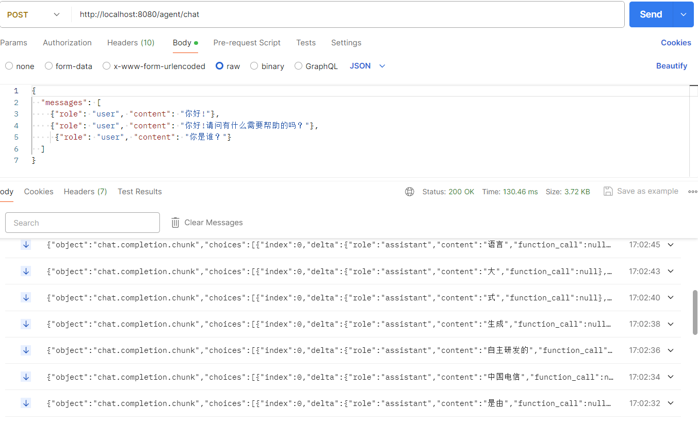

<div align="center">

Telechat-chat-openai
===========================
<h4> OpenAI style standard streaming multi-turn dialogue interface WEB API.</h4>

</div>


- Telechat-12b is supported by default, you can also support Telechat-7b & Telechat-11b by modifying the tokenizer loading here.

- This project only opens the chat-openai version of telechat. agent-chat-openai currently has no open source plans.

- This project also open sourced agent-chat-openai, implemented multi-round dialogue API scheduling management of agents, and released the openai-style standard streaming interface. If you want to use agent-chat-openai, please refer to https://github.com/THUDM/ChatGLM3/tree/main/openai_api_demo. In the agent-chat-openai project, the agent is designed to handle exceptions when calling API tools, which greatly enhances the agent user experience.For agent-chat exception self-handling effects, see:

```bash
examples/agent-exception-self-handling.pdf
```


## Quick Start

###  Installation package

Experimental environment:  python3.8 + cuda117 + pytorch2.0.0  + transformers4.37.0

```shell
pip3 install -r requirements.txt
```

### Run project

1. Adapt your model file path in the config.json file.

2. Run:

```bash
chat.sh
```

3. chat Curl 测试
```shell
curl -X POST "http://127.0.0.1:8080/agent/chat" \
-H "Content-Type: application/json" \
-d "{\"messages\": [{\"role\": \"user\", \"content\": \"你好，你是谁？\"}], \"stream\": true, \"max_tokens\": 100, \"temperature\": 0.8, \"top_p\": 0.8}"
````




## Contact information

Mail: whpxty5518@163.com


